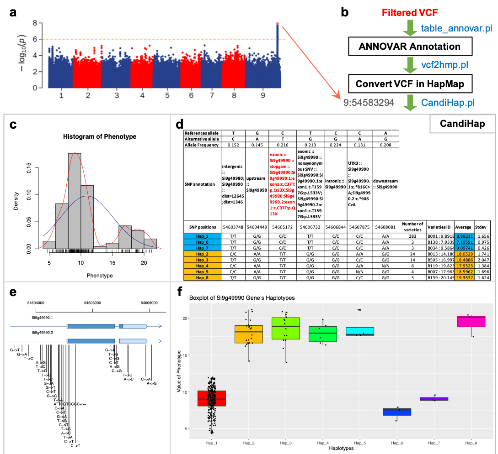

# CandiHap: a toolkit for fast identification of candidate causal genes in genome-wide association study
Genome-wide association study (GWAS) is widely utilized to identify genes involved in plants, animals and human complex traits. The identified SNP is not necessarily the causal variant, but it is rather in linkage disequilibrium (LD). One key challenge for GWAS data interpretation is to fast identify causal genes and provide profound evidence on how they affect the trait. Researches want to identify candidate causal variants from the most significant SNPs of GWAS in any species and on their local computer, while to complete these tasks are to be time-consuming, laborious and prone to errors and omission. To our knowledge, so far there is no tool available to solve the challenge for GWAS data very quickly. CandiHap is developed to identify candidate causal SNPs and genes from GWAS by integrating LD analysis, functional SNP annotation, haplotype analyses and traits statistics of haplotypes. CandiHap provides a very fast preselection form GWAS result to candidate causal variants.</br>


## Description
__`CandiHap`__ tool is developed to identify candidate causal SNPs and genes from GWAS by integrating linkage disequilibrium (LD) analysis, SNP annotation, haplotype analyses and traits statistics of haplotypes. CandiHap provides a very fast solution form GWAS result to candidate causal genes, and it will help researchers to derive candidate causal genes for complex traits study.</br>

> Xukai Li* (李旭凯), Zhiyong Shi (石志勇), Qianru Qie (郄倩茹), Jianhua Gao (高建华), Xingchun Wang (王兴春) & Yuanhuai Han (韩渊怀). CandiHap: a toolkit for fast identification of candidate causal genes in genome-wide association study.</br>

## Dependencies
__`perl 5`__, __`R ≥ 3.2`__ (with ggplot2), __`Python 2.7`__, and __`electron`__. </br></br>

## Getting started
There are mainly three steps included in the CandiHap analytical through command lines, and the test data files can freely download at test_data.</br>
Put __`vcf2hmp.pl`__  test.gff, test.vcf, and genome.fa files in a same dir, then run annovar (table_annovar.pl):</br>
```
     gffread  test.gff   -T -o test.gtf
     gtfToGenePred -genePredExt test.gtf  si_refGene.txt
     retrieve_seq_from_fasta.pl --format refGene --seqfile  genome.fa  si_refGene.txt --outfile si_refGeneMrna.fa
     
     table_annovar.pl  test.vcf  ./  --vcfinput --outfile  test --buildver  si --protocol refGene --operation g -remove
     
     # 0.1 means the minor allele frequency (MAF)
     perl  vcf2hmp.pl  test.vcf  test.si_multianno.txt  0.1
```
</br>

Put __`CandiHap.pl`__ and Phenotype.txt files in a same dir, then run:</br>
```
     perl  CandiHap.pl  ./Your.hmp  ./Phenotype.txt  ./genome.gff  Your_gene_ID
e.g. perl  CandiHap.pl  ./haplotypes.hmp   ./Phenotype.txt  ./test.gff  Si9g49990
```
</br>

By the way, if you want do All gene in LD region of a position, then run:</br>
```
     perl  GWAS_LD2haplotypes.pl   ./genome.gff  ./ann.hmp  ./Phenotype.txt  50kb  Chr:position
e.g. perl  GWAS_LD2haplotypes.pl   ./test.gff  ./haplotypes.hmp   ./Phenotype.txt   50kb  9:54583294
```
</br>

## Contact information
For any questions please contact xukai_li@sxau.edu.cn or xukai_li@qq.com</br>
